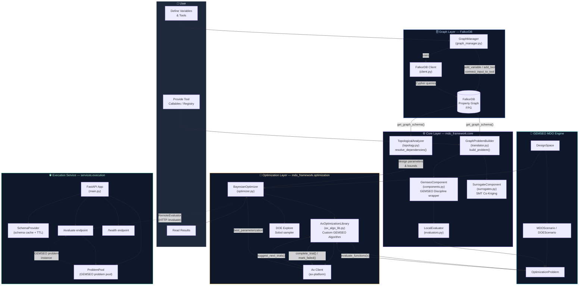

# GraphMDO: Dynamic Multi-Fidelity MDO Framework

[](https://www.python.org/)
[](https://pypi.org/project/graphmdo/)
[](https://github.com/jultou-raa/GraphMDO/actions/workflows/quality.yml)
[](https://github.com/jultou-raa/GraphMDO/actions/workflows/security.yml)
[](https://github.com/jultou-raa/GraphMDO/actions/workflows/docs.yml)
[](https://codecov.io/gh/jultou-raa/GraphMDO)

GraphMDO bridges data engineering and MDO. It extracts topological data (solvers, variables, fidelity levels) to form an oriented graph, specifically utilizing GEMSEO for semantic formulation and execution. Execution is handled natively by GEMSEO and the Surrogate Modeling Toolbox (SMT), driven by constrained Bayesian optimization (ax-platform) or evolutionary algorithms (pymoo). The primary operational goal is to isolate and maximize a single target performance metric while strictly holding all other performance metrics constant.

## Key Features

*   **Native Graph Formulation**: Uses [FalkorDB](https://falkordb.com/) to store problem definitions (variables, tools, dependencies) as a property graph.
*   **Dynamic Problem Construction**: Automatically translates the graph topology into an executable [GEMSEO](https://gemseo.readthedocs.io/) MDO formulation.
*   **Multi-Fidelity Surrogates**: Integrates [SMT](https://smt.readthedocs.io/en/latest/) for Co-Kriging and other surrogate models.
*   **Constrained Bayesian Optimization**: Leverages [Ax Platform](https://ax.dev/) for robust optimization, easily managing GEMSEO multi-objective targets, fidelity, and discrete/continuous parameters.

## Project Architecture

The framework is divided into four sequential phases, each corresponding to a layer of abstraction:

1. **Graph Layer** — FalkorDB stores the *Fundamental Problem Graph* (FPG): variables, tools, and directed connections.
2. **Core Layer** — Python modules translate the graph schema into executable GEMSEO constructs (disciplines, design space, topology).
3. **Execution Service** — A FastAPI microservice that manages a pool of GEMSEO `OptimizationProblem` instances and exposes an HTTP evaluation endpoint.
4. **Optimization Layer** — Bayesian (Ax Platform) or DOE (GEMSEO Sobol) drivers run over the GEMSEO MDO scenario.



## Installation

This project uses `uv` for dependency management.

1.  **Install uv** (if not installed):
    See [astral.sh/uv](https://astral.sh/uv).

2.  **Clone and Install**:
    ```bash
    git clone https://github.com/jultou-raa/GraphMDO.git
    cd GraphMDO
    uv sync
    ```

3.  **FalkorDB**:
    Ensure you have a running FalkorDB instance (e.g., via Docker):
    ```bash
    docker run -p 6379:6379 -it falkordb/falkordb
    ```

## Usage

### 1. Defining a Problem (Python API)

You can programmatically build your MDO problem graph:

```python
from mdo_framework.db.graph_manager import GraphManager

gm = GraphManager()
gm.clear_graph()

# Define Variables
gm.add_variable("x", value=1.0, lower=0.0, upper=10.0)
gm.add_variable("y", value=2.0, lower=0.0, upper=10.0)
gm.add_variable("z", value=0.0)

# Define Tool
gm.add_tool("MyTool")

# Define Connections
gm.connect_input_to_tool("x", "MyTool")
gm.connect_input_to_tool("y", "MyTool")
gm.connect_tool_to_output("MyTool", "z")
```

### 2. Running Optimization

Once the graph is populated, you can run the optimization workflow. You need to provide the actual Python functions corresponding to the tool names in the graph.

```python
from mdo_framework.core.translator import GraphProblemBuilder
from mdo_framework.optimization.optimizer import BayesianOptimizer
from mdo_framework.core.evaluators import LocalEvaluator
from mdo_framework.core.topology import TopologicalAnalyzer

# Define tool implementation
def my_tool_func(x, y):
    return x + y  # Simple example

# Registry maps graph tool names to Python callables
tool_registry = {
    "MyTool": my_tool_func
}

# Build GEMSEO Problem from Graph
schema = gm.get_graph_schema()
builder = GraphProblemBuilder(schema)
prob = builder.build_problem(tool_registry)

# Resolve Topology mapping design_vars automatically from the graph schema
analyzer = TopologicalAnalyzer(schema)
design_vars, _ = analyzer.resolve_dependencies(["z"])
parameters = analyzer.extract_parameters(design_vars)

# Run Optimization
evaluator = LocalEvaluator(prob)
optimizer = BayesianOptimizer(
    evaluator=evaluator,
    parameters=parameters,
    objectives=[{"name": "z", "minimize": True}],
)

result = optimizer.optimize(n_steps=10)
print(f"Best Result: {result['best_objectives']} at {result['best_parameters']}")
```

### 3. Running Tests

```bash
uv run pytest tests/
```

## Contributing

1.  Follow PEP 8 guidelines.
2.  Ensure 100% test coverage for new features.
3.  Use `uv run pre-commit run --all-files` before committing.

## License

This project is licensed under the Mozilla Public License 2.0 (MPL-2.0). See the [LICENSE](LICENSE) file for details.
